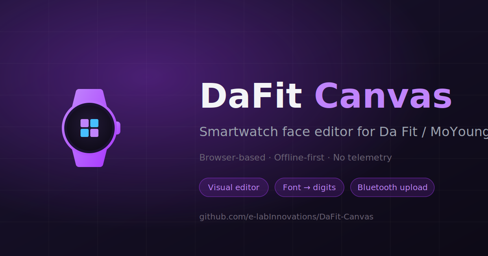
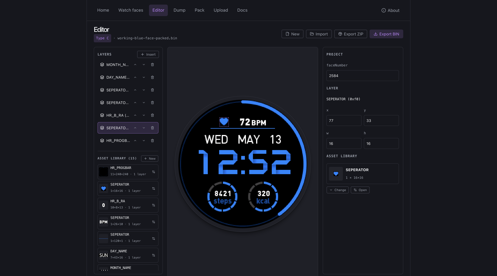
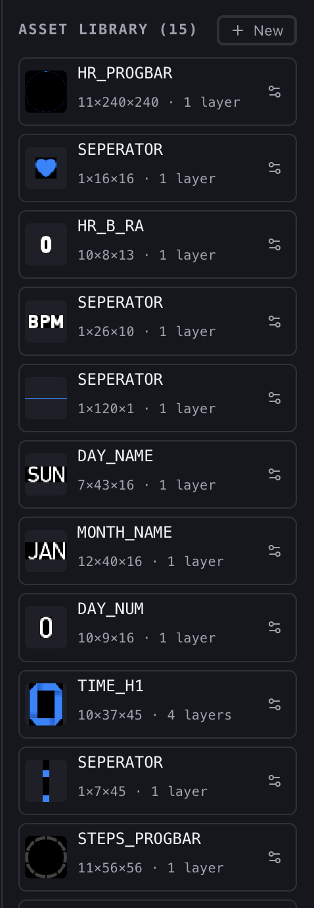
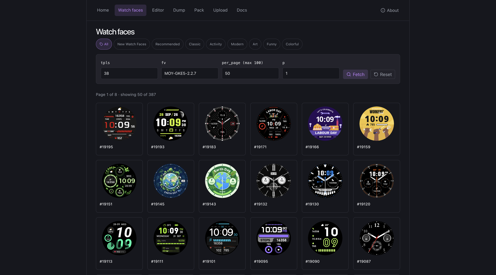

# DaFit Canvas

A web-based visual editor for designing smartwatch faces compatible with the **Da Fit / MoYoung** ecosystem. Import an existing `.bin`, swap assets, retouch positions, regenerate digits from a font, and export a watch-ready binary — without ever touching a hex editor.

<!-- TODO: replace with a real hero screenshot of the editor -->



---

## Features

- **Import & decode** real Type C `.bin` files (`fileID 0x81`, `faceNumber 50001`, RGB565 little-endian) and the alternative FaceN format.
- **Layer-based editor** with a live 240×240 canvas, drag-to-position, and per-layer properties.
- **Shared asset library** — multiple layers can point at the same bitmap set (the way the firmware actually packs digits, weekday strings, progress bars, etc.).
- **Font-to-digits generator** — drop in any TTF/OTF or pick a system font and generate a 10-glyph digit set (or a 7-glyph weekday set) at the exact pixel dimensions the watch expects.
- **MoYoung face browser** — search and preview the official catalogue, download `.bin`s straight into the editor.
- **Round-trip safe** — per-blob compression (RLE_LINE vs raw) is preserved on import/export, so re-saving a working face never breaks it on the watch.
- **Pack / Dump pages** — a low-level workbench for inspecting blobs, repacking, and exporting back to `.bin`.

<!-- TODO: replace with a screenshot of the layer list + canvas -->



<!-- TODO: replace with a screenshot of the asset library / picker -->



<!-- TODO: replace with a screenshot of the watch faces browser -->



---

## Watch hardware target

- **240×240** circular display
- **16-bit RGB565**, little-endian, no alpha channel
- Type **C** binary (`fileType C`, `fileID 0x81`, `faceNumber 50001`)

The editor includes a built-in **Upload** page that talks to the watch over Web Bluetooth — no external uploader required. `dawft` / `dawfu` are still listed under **Credits** below since this project is built on top of their reverse-engineering work.

> ⚠️ **Use at your own risk.** This is hobby software written against a reverse-engineered format. Flashing a malformed face won't brick the watch in any case I've seen, but I make no guarantees — try it on a watch you can afford to wipe.

**Tested on:** Porodo **Vortex** (round) watch, firmware **MOY-GKE5-2.2.7**. Other Da Fit / MoYoung watches _should_ work but are not verified.

---

## Quick start

```bash
git clone https://github.com/e-labInnovations/DaFit-Canvas.git
cd DaFit-Canvas
npm install
npm run dev
```

Then open the URL Vite prints (typically `http://localhost:5173`).

### Build for production

```bash
npm run build      # tsc -b && vite build
npm run preview    # serve the built bundle
```

### Lint

```bash
npm run lint
```

---

## Usage

1. **Browse** the MoYoung catalogue under `/watch-faces`, pick a face, and download its `.bin`.
2. Open `/editor`, import the `.bin` (or a previously-exported project `.zip`).
3. Edit layers: change positions, swap bitmaps, regenerate digits from a font, or insert a new layer.
4. Export back to `.bin`, then push it to your watch directly from the `/upload` page (Web Bluetooth) — or hand it off to `dawfu` if you prefer the original CLI.

<!-- TODO: short GIF/video of the editing workflow -->
<!--  -->

For a deeper explanation of how Type C watch faces are structured, what each layer type means, and how the binary is laid out — open the in-app **Watchface format** docs page (`/docs`).

---

## Tech stack

- React 19 + TypeScript 6 + Vite 8
- Zustand for editor state
- JSZip for project packaging
- Axios for the MoYoung API client
- HTML5 Canvas for rendering (no Konva)

No backend, no telemetry — everything runs in the browser.

---

## Project layout

```
src/
  components/     UI components (editor panels, modals, dump viewers)
  lib/            Domain logic — dawft.ts (Type C codec), faceN.ts,
                  projectIO.ts (import/export), bmp.ts, moyoung.ts
  pages/          Top-level routes (Editor, WatchFaces, Pack, Dump, Docs)
  store/          Zustand editor store
  types/          Shared TS types
scripts/          Corpus tooling (extract-watchfaces, analyze-corpus, …)
faces-corpus/     387 real watch faces used to derive defaults (gitignored)
```

See [CLAUDE.md](CLAUDE.md) for engineering rules, format notes, and corpus-derived sharing/whitelist data.

---

## Author

Built by **Mohammed Ashad** — [@e-labInnovations](https://github.com/e-labInnovations).

---

## Credits

DaFit Canvas would not exist without the reverse-engineering work of **David Atkinson**. All Type C decoding and packing in this editor descends directly from his tools:

- [**dawft**](https://github.com/david47k/dawft) — original Da Fit watch face CLI (decode/encode `.bin`).
- [**extrathundertool**](https://github.com/david47k/extrathundertool) — companion utility for related watch protocols.
- [**dawfu**](https://github.com/david47k/dawfu) — BLE uploader for built `.bin` files.

---

## License

MIT. See [LICENSE](LICENSE) if present, otherwise treat this repo as MIT-licensed pending a formal file.
